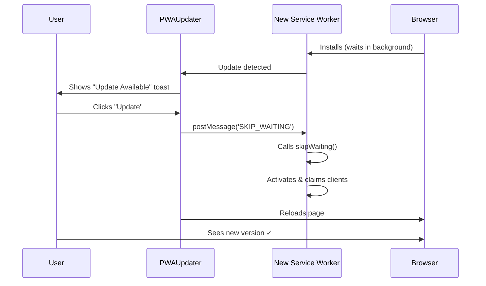

```mermaid
sequenceDiagram
    participant User
    participant PWAUpdater
    participant NewSW as New Service Worker
    participant Browser
    
    Browser->>NewSW: Installs (waits in background)
    NewSW->>PWAUpdater: Update detected
    PWAUpdater->>User: Shows "Update Available" toast
    User->>PWAUpdater: Clicks "Update"
    PWAUpdater->>NewSW: postMessage('SKIP_WAITING')
    NewSW->>NewSW: Calls skipWaiting()
    NewSW->>NewSW: Activates & claims clients
    PWAUpdater->>Browser: Reloads page
    User->>Browser: Sees new version ✓
```