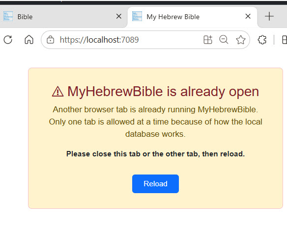

https://www.myhebrewbible.com/

# Prompt:

> Error: "another open Access Handle or Writable stream associated with the same file" I'm having this exception show below when I startup my and (I believe) when another instance  of my PWA is running app 

> What I want to do is handle this situation more elegantly i.e. 
> pass a message to the UI that e.g. "An instances of MyHebrewBible is running but only one is allowed"

### Reply
> The app crashes at startup before Blazor renders the UI, so the best approach is to **catch the OPFS lock exception** specifically in `Program.cs`, then use `IJSRuntime` (available from the built host) to inject a friendly message into the #app div instead of rethrowing.


### Tested by opening a second tab
> here's what it looked like after I made the suggested changes to `Program.cs`




### What changed:
#### 1.	Added using `Microsoft.JSInterop`; at the top.

#### 2.	Changed 
```csharp
var host = builder.Build()
```
to 
```csharp
WebAssemblyHost? host = null
```
declared before the try, so the variable is accessible in catch blocks.
#### 3.	Added a specific catch block 
The catch block filters on the `OPFS createSyncAccessHandle exception message — this fires when a second tab tries to open the locked database.

#### 4.	In that catch, it uses IJSInProcessRuntime.InvokeVoid
`("eval", ...)` to replace the `#app` div with a styled Bootstrap-friendly warning panel that explains the situation and offers a Reload button.

#### 5.	The generic `catch` (which re-throws) is still in place for any other unexpected fatal errors.

### Result: 
When a second tab opens the app and the OPFS database is locked, instead of a blank crash screen, the user sees a clear message: "MyHebrewBible is already open — only one tab is allowed at a time. Please close this tab or the other tab, then reload."

### `Program.cs` additions

```csharp
using Microsoft.JSInterop; // added 
//...
WebAssemblyHost? host = null; // added; moved above `try`
try
{
  host = builder.Build();  // was `var host = builder.Build();`
//...
}
catch (Exception ex) when (ex.Message.Contains("createSyncAccessHandle") || ex.Message.Contains("Access Handles cannot be created"))
{
  Log.Warning(ex, "PWA WebAssembly App could not start: OPFS database locked by another tab");
  if (host is not null)
  {
    var js = (IJSInProcessRuntime)host.Services.GetRequiredService<IJSRuntime>();
    js.InvokeVoid("eval", """
      (function() {
        var app = document.getElementById('app');
        if (app) {
          app.innerHTML = '<div style="font-family:sans-serif;max-width:540px;margin:80px auto;padding:2rem;border:1px solid #f5c2c7;border-radius:.5rem;background:#fff3cd;text-align:center;">'
            + '<h2 style="color:#842029;">&#9888; MyHebrewBible is already open</h2>'
            + '<p style="color:#664d03;font-size:1.1rem;">Another browser tab is already running MyHebrewBible. Only one tab is allowed at a time because of how the local database works.</p>'
            + '<p><strong>Please close this tab or the other tab, then reload.</strong></p>'
            + '<button onclick="location.reload()" style="margin-top:1rem;padding:.5rem 1.5rem;font-size:1rem;cursor:pointer;border-radius:.375rem;border:none;background:#0d6efd;color:#fff;">Reload</button>'
            + '</div>';
        }
      })();
      """);
  }
}
```